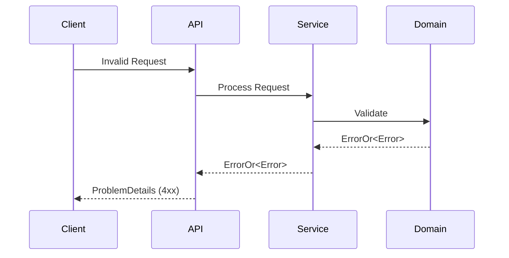
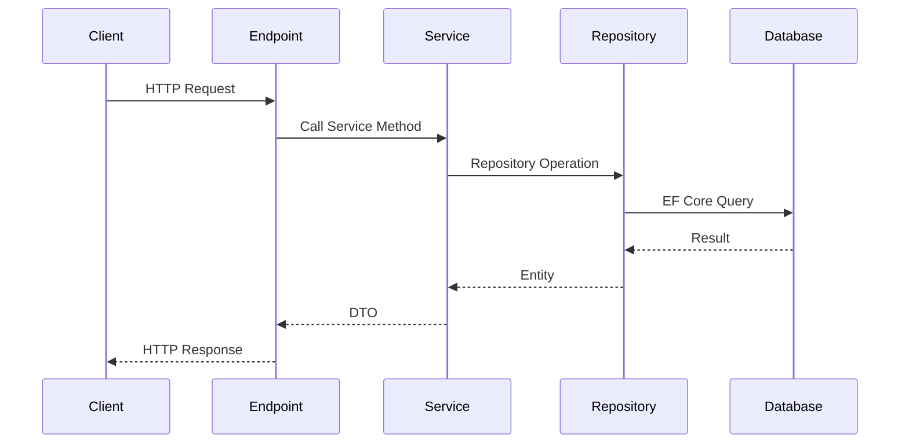

# API Reference Guide

Complete API documentation for the CleanArchitecture REST API.

## Table of Contents

1. [Base URL](#base-url)
2. [Authentication](#authentication)
3. [Error Handling](#error-handling)
4. [Endpoints](#endpoints)
5. [Request/Response Models](#requestresponse-models)
6. [Status Codes](#status-codes)

## Base URL

```powershell
Development: https://localhost:5001
Production:  https://your-domain.com/api
```

## Authentication

Currently, the API does not require authentication. For production use, consider implementing:

- JWT Bearer tokens
- API Keys
- OAuth 2.0

## Error Handling

All errors follow RFC 7807 ProblemDetails format:

```json
{
  "type": "https://tools.ietf.org/html/rfc7231#section-6.5.1",
  "title": "Validation Error",
  "status": 400,
  "detail": "Item name cannot be empty",
  "errors": {
    "Item.NameEmpty": ["Item name cannot be empty"]
  }
}
```

### Error Flow



## Endpoints

### Health Check

#### GET /health

Check API health status.

**Response:** `200 OK`

```json
{
  "status": "Healthy"
}
```

---

### Items API

#### GET /api/items

Retrieve all items.

**Request:**

```http
GET /api/items HTTP/1.1
Host: localhost:5001
```

**Response:** `200 OK`

```json
[
  {
    "id": "3fa85f64-5717-4562-b3fc-2c963f66afa6",
    "name": "Sample Item",
    "description": "This is a sample item",
    "createdAt": "2026-06-02T10:30:00Z",
    "updatedAt": null
  }
]
```

**cURL Example:**

```bash
curl -X GET https://localhost:5001/api/items
```

---

#### GET /api/items/{id}

Retrieve a specific item by ID.

**Parameters:**

- `id` (path, required): UUID of the item

**Response:** `200 OK`

```json
{
  "id": "3fa85f64-5717-4562-b3fc-2c963f66afa6",
  "name": "Sample Item",
  "description": "This is a sample item",
  "createdAt": "2026-06-02T10:30:00Z",
  "updatedAt": null
}
```

**Error Response:** `404 Not Found`

```json
{
  "type": "https://tools.ietf.org/html/rfc7231#section-6.5.4",
  "title": "Not Found",
  "status": 404,
  "detail": "Item with ID '3fa85f64-5717-4562-b3fc-2c963f66afa6' was not found"
}
```

**cURL Example:**

```bash
curl -X GET https://localhost:5001/api/items/3fa85f64-5717-4562-b3fc-2c963f66afa6
```

---

#### POST /api/items

Create a new item.

**Request Body:**

```json
{
  "name": "New Item",
  "description": "Item description"
}
```

**Validation Rules:**

- `name`: Required, max 200 characters
- `description`: Required, max 1000 characters

**Response:** `201 Created`

```json
{
  "id": "3fa85f64-5717-4562-b3fc-2c963f66afa6",
  "name": "New Item",
  "description": "Item description",
  "createdAt": "2026-06-02T10:30:00Z",
  "updatedAt": null
}
```

**Headers:**

```powershell
Location: /api/items/3fa85f64-5717-4562-b3fc-2c963f66afa6
```

**Error Response:** `400 Bad Request`

```json
{
  "type": "https://tools.ietf.org/html/rfc7231#section-6.5.1",
  "title": "Validation Error",
  "status": 400,
  "detail": "Item name cannot be empty"
}
```

**cURL Example:**

```bash
curl -X POST https://localhost:5001/api/items \
  -H "Content-Type: application/json" \
  -d '{"name":"New Item","description":"Item description"}'
```

---

#### PUT /api/items/{id}

Update an existing item.

**Parameters:**

- `id` (path, required): UUID of the item

**Request Body:**

```json
{
  "name": "Updated Item",
  "description": "Updated description"
}
```

**Response:** `200 OK`

```json
{
  "id": "3fa85f64-5717-4562-b3fc-2c963f66afa6",
  "name": "Updated Item",
  "description": "Updated description",
  "createdAt": "2026-06-02T10:30:00Z",
  "updatedAt": "2026-06-02T11:00:00Z"
}
```

**Error Responses:**

- `404 Not Found` - Item does not exist
- `400 Bad Request` - Validation error

**cURL Example:**

```bash
curl -X PUT https://localhost:5001/api/items/3fa85f64-5717-4562-b3fc-2c963f66afa6 \
  -H "Content-Type: application/json" \
  -d '{"name":"Updated Item","description":"Updated description"}'
```

---

#### DELETE /api/items/{id}

Delete an item.

**Parameters:**

- `id` (path, required): UUID of the item

**Response:** `204 No Content`

**Error Response:** `404 Not Found`

```json
{
  "type": "https://tools.ietf.org/html/rfc7231#section-6.5.4",
  "title": "Not Found",
  "status": 404,
  "detail": "Item with ID '3fa85f64-5717-4562-b3fc-2c963f66afa6' was not found"
}
```

**cURL Example:**

```bash
curl -X DELETE https://localhost:5001/api/items/3fa85f64-5717-4562-b3fc-2c963f66afa6
```

---

## Request/Response Models

### CreateItemRequest

```csharp
public record CreateItemRequest(
    string Name,
    string Description
);
```

**JSON Schema:**

```json
{
  "type": "object",
  "required": ["name", "description"],
  "properties": {
    "name": {
      "type": "string",
      "minLength": 1,
      "maxLength": 200
    },
    "description": {
      "type": "string",
      "minLength": 1,
      "maxLength": 1000
    }
  }
}
```

### UpdateItemRequest

```csharp
public record UpdateItemRequest(
    string Name,
    string Description
);
```

**JSON Schema:**

```json
{
  "type": "object",
  "required": ["name", "description"],
  "properties": {
    "name": {
      "type": "string",
      "minLength": 1,
      "maxLength": 200
    },
    "description": {
      "type": "string",
      "minLength": 1,
      "maxLength": 1000
    }
  }
}
```

### ItemResponse

```csharp
public record ItemResponse(
    Guid Id,
    string Name,
    string Description,
    DateTime CreatedAt,
    DateTime? UpdatedAt
);
```

**JSON Schema:**

```json
{
  "type": "object",
  "properties": {
    "id": {
      "type": "string",
      "format": "uuid"
    },
    "name": {
      "type": "string"
    },
    "description": {
      "type": "string"
    },
    "createdAt": {
      "type": "string",
      "format": "date-time"
    },
    "updatedAt": {
      "type": "string",
      "format": "date-time",
      "nullable": true
    }
  }
}
```

## Status Codes

| Code | Description           | Usage                   |
| ---- | --------------------- | ----------------------- |
| 200  | OK                    | Successful GET, PUT     |
| 201  | Created               | Successful POST         |
| 204  | No Content            | Successful DELETE       |
| 400  | Bad Request           | Validation error        |
| 404  | Not Found             | Resource not found      |
| 500  | Internal Server Error | Unexpected server error |

## API Request Flow



## Testing the API

### Using .http Files

The project includes `.http` files for testing with REST Client or similar tools:

```http
### Get all items
GET https://localhost:5001/api/items

### Get item by ID
GET https://localhost:5001/api/items/{{itemId}}

### Create item
POST https://localhost:5001/api/items
Content-Type: application/json

{
  "name": "Test Item",
  "description": "This is a test item"
}

### Update item
PUT https://localhost:5001/api/items/{{itemId}}
Content-Type: application/json

{
  "name": "Updated Item",
  "description": "Updated description"
}

### Delete item
DELETE https://localhost:5001/api/items/{{itemId}}
```

### Using Swagger/OpenAPI

Navigate to `/openapi/v1.json` to view the OpenAPI specification.

## Rate Limiting

Currently not implemented. Consider adding for production:

- Per IP rate limiting
- Per user rate limiting
- Throttling policies

## Versioning

Current version: v1

Future versions should use:

- URL versioning: `/api/v2/items`
- Header versioning: `X-API-Version: 2`
- Media type versioning: `application/vnd.api.v2+json`

## Best Practices

1. **Always validate input** - Use strong typing and validation
2. **Use appropriate status codes** - Follow REST conventions
3. **Include error details** - Help clients debug issues
4. **Version your API** - Plan for future changes
5. **Document changes** - Maintain this documentation
6. **Handle errors gracefully** - Return meaningful error messages
7. **Use HTTPS** - Secure all endpoints in production

## Security Considerations

For production deployment:

- ✅ Enable HTTPS
- ✅ Add authentication/authorization
- ✅ Implement rate limiting
- ✅ Validate all inputs
- ✅ Use CORS policies
- ✅ Add request logging
- ✅ Implement API versioning
- ✅ Add health checks for monitoring

## Further Reading

- [ARCHITECTURE.md](./ARCHITECTURE.md) - System architecture
- [TESTING_STRATEGY.md](./TESTING_STRATEGY.md) - Testing approach
- [DEPLOYMENT.md](./DEPLOYMENT.md) - Deployment guide
