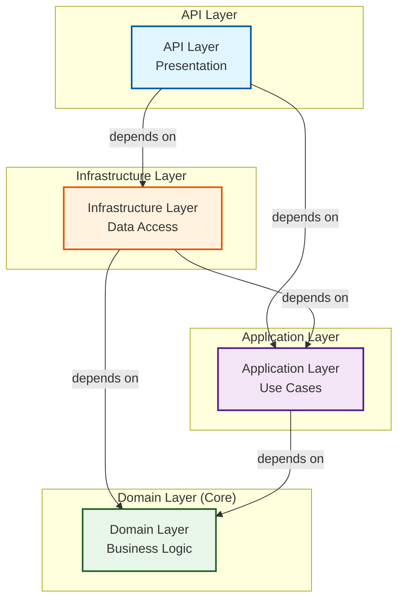
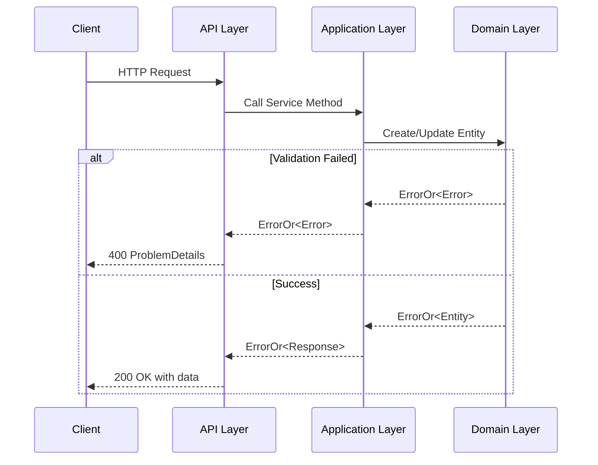

# Clean Architecture Overview

This document provides an overview of the Clean Architecture implementation in this project.

## Architecture Layers

This project implements Clean Architecture with four distinct layers:



**Layer Responsibilities:**

- **API Layer**: HTTP endpoints, routing, serialization, Program.cs, Endpoints
- **Infrastructure Layer**: Database context, repositories, external service integrations
- **Application Layer**: Business workflows, DTOs, service interfaces
- **Domain Layer**: Entities, value objects, domain errors, business rules

### Dependency Rules

**The Dependency Rule:** Source code dependencies must point inward only.

- Domain → No dependencies
- Application → Domain only
- Infrastructure → Application + Domain
- API → All layers (composition root)

## Layer Details

### 1. Domain Layer (`CleanArchitecture.Domain`)

**Purpose:** Contains enterprise business rules and entities

**Responsibilities:**

- Define core entities and aggregates
- Implement business rule validation
- Define domain errors
- Provide base classes for entities

**No Dependencies On:**

- ❌ Entity Framework
- ❌ ASP.NET Core
- ❌ External libraries (except ErrorOr)

**Key Components:**

```text
Domain/
├── Common/
│   └── Entity.cs                    # Base entity class
├── Entities/
│   └── Item.cs                      # Domain entity with factory methods
├── Errors/
│   └── ItemErrors.cs                # Domain-specific errors
└── Repositories/
    └── IItemRepository.cs           # Repository interface (abstraction)
```

**Example Entity:**

```csharp
public sealed class Item : Entity
{
    private string _name;
    private string _description;

    public static ErrorOr<Item> Create(string name, string description)
    {
        // Validation logic in domain
        if (string.IsNullOrWhiteSpace(name))
            return ItemErrors.NameEmpty;

        return new Item(name, description);
    }

    public ErrorOr<Updated> Update(string name, string description)
    {
        // Business rule enforcement
        var validationResult = ValidateItem(name, description);
        if (validationResult.IsError)
            return validationResult.Errors;

        _name = name;
        _description = description;
        UpdatedAt = DateTime.UtcNow;

        return Result.Updated;
    }
}
```

### 2. Application Layer (`CleanArchitecture.Application`)

**Purpose:** Contains application business logic and use cases

**Responsibilities:**

- Orchestrate domain objects
- Define DTOs for data transfer
- Implement use case workflows
- Define service interfaces

**Dependencies:**

- ✅ Domain layer only

**Key Components:**

```text
Application/
├── Interfaces/
│   └── IItemService.cs              # Service interface
├── Models/
│   └── ItemModels.cs                # Request/Response DTOs
├── Services/
│   └── ItemService.cs               # Use case implementation
└── DependencyInjection.cs           # Service registration
```

**Example Service:**

```csharp
public sealed class ItemService(IItemRepository repository) : IItemService
{
    public async Task<ErrorOr<ItemResponse>> CreateItemAsync(
        CreateItemRequest request,
        CancellationToken cancellationToken = default)
    {
        // Delegate to domain for creation
        var itemResult = Item.Create(request.Name, request.Description);
        if (itemResult.IsError)
            return itemResult.Errors;

        // Persist using repository
        var createdItem = await repository.AddAsync(
            itemResult.Value,
            cancellationToken);

        return MapToResponse(createdItem);
    }
}
```

### 3. Infrastructure Layer (`CleanArchitecture.Infrastructure`)

**Purpose:** Implements interfaces and handles external concerns

**Responsibilities:**

- Implement repository interfaces
- Configure Entity Framework Core
- Handle database migrations
- Integrate with external services

**Dependencies:**

- ✅ Application layer
- ✅ Domain layer
- ✅ EF Core, database providers

**Key Components:**

```text
Infrastructure/
├── Data/
│   ├── ApplicationDbContext.cs      # EF Core context
│   └── Configurations/
│       └── ItemConfiguration.cs     # Entity configuration
├── Repositories/
│   └── ItemRepository.cs            # Repository implementation
└── DependencyInjection.cs           # Infrastructure registration
```

**Example Repository:**

```csharp
public sealed class ItemRepository(ApplicationDbContext context) : IItemRepository
{
    public async Task<Item?> GetByIdAsync(Guid id, CancellationToken ct = default)
    {
        return await context.Items
            .AsNoTracking()
            .FirstOrDefaultAsync(x => x.Id == id, ct);
    }

    public async Task<Item> AddAsync(Item item, CancellationToken ct = default)
    {
        await context.Items.AddAsync(item, ct);
        await context.SaveChangesAsync(ct);
        return item;
    }
}
```

### 4. API Layer (`CleanArchitecture.Api`)

**Purpose:** HTTP interface and application composition root

**Responsibilities:**

- Define HTTP endpoints
- Handle routing and serialization
- Configure dependency injection
- Implement middleware pipeline

**Dependencies:**

- ✅ All other layers

**Key Components:**

```text
Api/
├── Program.cs                       # Application entry point
├── Endpoints/
│   └── ItemEndpoints.cs             # Minimal API endpoints
└── Extensions/
    └── ErrorOrExtensions.cs         # ErrorOr to ProblemDetails mapping
```

**Example Endpoint:**

```csharp
public static class ItemEndpoints
{
    public static IEndpointRouteBuilder MapItemEndpoints(this IEndpointRouteBuilder endpoints)
    {
        var group = endpoints.MapGroup("/api/items").WithTags("Items");

        group.MapPost("/", CreateItem)
            .WithName("CreateItem")
            .Produces<ItemResponse>(StatusCodes.Status201Created)
            .Produces<ProblemDetails>(StatusCodes.Status400BadRequest);

        return endpoints;
    }

    private static async Task<IResult> CreateItem(
        CreateItemRequest request,
        IItemService itemService,
        CancellationToken cancellationToken)
    {
        var result = await itemService.CreateItemAsync(request, cancellationToken);
        return result.Match(
            item => Results.CreatedAtRoute("GetItemById", new { id = item.Id }, item),
            errors => Results.Problem(errors.ToProblemDetails()));
    }
}
```

## Design Patterns

### 1. Marker Interface Pattern

Assembly markers for type-safe reflection and testing.

Each layer contains a marker interface in the `Markers/` folder:

```csharp
// Domain/Markers/IAssemblyMarkerDomain.cs
namespace CleanArchitecture.Domain.Markers;

public interface IAssemblyMarkerDomain { }
```

**Usage in Tests:**

```csharp
// Architecture tests
private static readonly Assembly DomainAssembly = typeof(IAssemblyMarkerDomain).Assembly;
private static readonly Assembly ApplicationAssembly = typeof(IAssemblyMarkerApplication).Assembly;

[Fact]
public void Domain_ShouldNotHaveDependencyOnOtherLayers()
{
    var result = Types.InAssembly(DomainAssembly)
        .ShouldNot()
        .HaveDependencyOnAny("CleanArchitecture.Application", ...)
        .GetResult();
}
```

**Benefits:**

- Type-safe assembly references (no magic strings)
- Clear intent and documentation
- IntelliSense support
- Easy refactoring

### 2. Repository Pattern

Abstracts data access logic from business logic.

```csharp
// Interface in Domain
public interface IItemRepository
{
    Task<Item?> GetByIdAsync(Guid id, CancellationToken ct = default);
    Task<Item> AddAsync(Item item, CancellationToken ct = default);
}

// Implementation in Infrastructure
public sealed class ItemRepository(ApplicationDbContext context) : IItemRepository
{
    // EF Core implementation
}
```

### 3. Factory Method Pattern

Controlled entity creation with validation.

```csharp
// Private constructor prevents invalid state
private Item(string name, string description)
{
    _name = name;
    _description = description;
}

// Factory method with validation
public static ErrorOr<Item> Create(string name, string description)
{
    var validationResult = ValidateItem(name, description);
    if (validationResult.IsError)
        return validationResult.Errors;

    return new Item(name, description);
}
```

### 4. Result Pattern (ErrorOr)

Type-safe error handling without exceptions for flow control.

```csharp
public async Task<ErrorOr<ItemResponse>> GetItemByIdAsync(Guid id)
{
    var item = await repository.GetByIdAsync(id);

    return item is not null
        ? MapToResponse(item)
        : ItemErrors.NotFound(id);
}
```

### 5. Dependency Injection

Loose coupling and testability.

```csharp
// Service registration
public static IServiceCollection AddApplication(this IServiceCollection services)
{
    services.AddScoped<IItemService, ItemService>();
    return services;
}

// Constructor injection
public sealed class ItemService(IItemRepository repository) : IItemService
{
    // repository is automatically injected
}
```

### 6. Minimal APIs with Extension Methods

Clean organization of endpoints.

```csharp
// In Program.cs
app.MapItemEndpoints();

// Endpoint definition in separate file
public static IEndpointRouteBuilder MapItemEndpoints(...)
{
    // Endpoint mappings
}
```

## Central Package Management

The solution uses **Central Package Management** (CPM) to manage NuGet package versions from a single location.

### Configuration Files

**Directory.Build.props** - Common MSBuild properties:

```xml
<Project>
  <PropertyGroup>
    <TargetFramework>net10.0</TargetFramework>
    <Nullable>enable</Nullable>
    <ImplicitUsings>enable</ImplicitUsings>
    <LangVersion>latest</LangVersion>
    <ManagePackageVersionsCentrally>true</ManagePackageVersionsCentrally>
  </PropertyGroup>
</Project>
```

**Directory.Packages.props** - Centralized package versions:

```xml
<Project>
  <ItemGroup Label="Core Packages">
    <PackageVersion Include="ErrorOr" Version="2.1.1" />
    <PackageVersion Include="Microsoft.EntityFrameworkCore" Version="10.0.8" />
  </ItemGroup>

  <ItemGroup Label="Test Packages">
    <PackageVersion Include="xUnit" Version="2.9.2" />
    <PackageVersion Include="FluentAssertions" Version="8.10.0" />
  </ItemGroup>
</Project>
```

**Project Files** - Reference packages without versions:

```xml
<ItemGroup>
  <PackageReference Include="ErrorOr" />
  <PackageReference Include="Microsoft.EntityFrameworkCore" />
</ItemGroup>
```

### Benefits

✅ **Single Source of Truth** - All package versions in one place  
✅ **Consistency** - Same versions across all projects  
✅ **Easy Updates** - Change version once, applies everywhere  
✅ **Reduced Conflicts** - No version mismatches  
✅ **Faster Builds** - NuGet resolves dependencies faster  
✅ **Better Maintainability** - Clear dependency overview

### Version Management

To update a package version:

1. Edit `Directory.Packages.props`
2. Change the version number
3. Run `dotnet restore`
4. All projects automatically use the new version

## Error Handling Strategy

### Domain Errors

Defined in the Domain layer, representing business rule violations.

```csharp
public static class ItemErrors
{
    public static Error NotFound(Guid id) => Error.NotFound(
        "Item.NotFound",
        $"Item with ID '{id}' was not found");

    public static Error NameEmpty => Error.Validation(
        "Item.NameEmpty",
        "Item name cannot be empty");
}
```

### Error Flow



### Error Response Format

```json
{
  "type": "https://tools.ietf.org/html/rfc7231#section-6.5.1",
  "title": "Bad Request",
  "status": 400,
  "errors": {
    "Item.NameEmpty": ["Item name cannot be empty"]
  }
}
```

## Key Principles

### 1. Separation of Concerns

Each layer has a single, well-defined responsibility.

### 2. Dependency Inversion

High-level modules don't depend on low-level modules. Both depend on abstractions.

```csharp
// Application depends on abstraction (interface)
public interface IItemRepository { }

// Infrastructure provides implementation
public class ItemRepository : IItemRepository { }
```

### 3. Single Responsibility

Each class has one reason to change.

### 4. Don't Repeat Yourself (DRY)

Common logic is extracted and reused.

### 5. SOLID Principles

- **S**ingle Responsibility
- **O**pen/Closed
- **L**iskov Substitution
- **I**nterface Segregation
- **D**ependency Inversion

## Benefits of This Architecture

### ✅ Testability

- Easy to mock dependencies
- Fast unit tests without database
- Integration tests with real database

### ✅ Maintainability

- Clear separation of concerns
- Changes isolated to specific layers
- Self-documenting code structure

### ✅ Flexibility

- Easy to swap implementations
- Database-agnostic (can switch from SQLite to PostgreSQL)
- Framework-independent business logic

### ✅ Scalability

- Horizontal scaling friendly
- Easy to add new features
- Refactoring-safe with tests

### ✅ Domain-Centric

- Business logic is central
- Domain experts can understand the code
- Clear business rules

## Project Structure

```text
CleanArchitecture/
├── src/
│   ├── CleanArchitecture.Api/              # HTTP API
│   ├── CleanArchitecture.Application/      # Use cases
│   ├── CleanArchitecture.Domain/           # Business logic
│   └── CleanArchitecture.Infrastructure/   # Data access
├── tests/
│   ├── CleanArchitecture.Api.Tests/        # API tests
│   ├── CleanArchitecture.Application.Tests/ # Service tests
│   ├── CleanArchitecture.Domain.Tests/     # Entity tests
│   ├── CleanArchitecture.Infrastructure.Tests/ # Repository tests
│   ├── CleanArchitecture.IntegrationTests/ # E2E tests
│   └── CleanArchitecture.ArchitectureTests/ # Rule enforcement
└── docs/
    ├── ARCHITECTURE.md                      # This file
    └── TESTING_STRATEGY.md                  # Testing guide
```

## When to Use Clean Architecture

### ✅ Good Fit For

- Long-lived applications
- Complex business logic
- Need for high testability
- Multiple UI or API clients
- Frequent requirement changes

### ⚠️ Consider Alternatives For

- Simple CRUD applications
- Short-lived prototypes
- Tight deadlines with simple requirements
- Small team with limited resources

## Further Reading

- [Clean Architecture by Robert C. Martin](https://blog.cleancoder.com/uncle-bob/2012/08/13/the-clean-architecture.html)
- [Hexagonal Architecture](https://alistair.cockburn.us/hexagonal-architecture/)
- [Domain-Driven Design](https://martinfowler.com/tags/domain%20driven%20design.html)
- [SOLID Principles](https://en.wikipedia.org/wiki/SOLID)

## Architecture Update (Merged)

This section consolidates the previous architecture update notes into this single architecture document.

### Completed Changes

1. ErrorOr integration across Domain, Application, and API layers for type-safe functional error handling.
2. C# 12 primary constructors adopted in services and repositories.
3. DTO naming migrated to Request/Response models under Application Models.
4. Domain errors centralized in ItemErrors and entity operations updated to return ErrorOr.
5. API endpoints updated to Match-based handling with ProblemDetails mapping.
6. Infrastructure repository implementations modernized and aligned with the updated error flow.

### Request/Response Model Conventions

- CreateItemDto -> CreateItemRequest
- UpdateItemDto -> UpdateItemRequest
- ItemDto -> ItemResponse

```csharp
public record CreateItemRequest(string Name, string Description);
public record UpdateItemRequest(string Name, string Description);
public record ItemResponse(Guid Id, string Name, string Description, DateTime CreatedAt, DateTime? UpdatedAt);
```

### Error Handling Migration Summary

| Aspect | Before | After |
|--------|--------|-------|
| Not found | `return null` | `return ItemErrors.NotFound(id)` |
| Validation | Throw exceptions | Return `Error.Validation(...)` via `ErrorOr<T>` |
| API flow | Try/catch centric | `Match(...)` centric |
| Error format | Ad hoc payloads | Standardized `ProblemDetails` |

### Consolidated Impact

- Cleaner domain and application contracts with explicit success/error outcomes.
- Consistent API behavior for validation and not-found scenarios.
- Reduced constructor boilerplate and improved readability with primary constructors.
- Improved maintainability through centralized error definitions and consistent model naming.

### Version Notes

- Last updated: June 2, 2026
- Architecture version: 2.0.0
- Style: Clean Architecture + Hexagonal + DDD + ErrorOr
