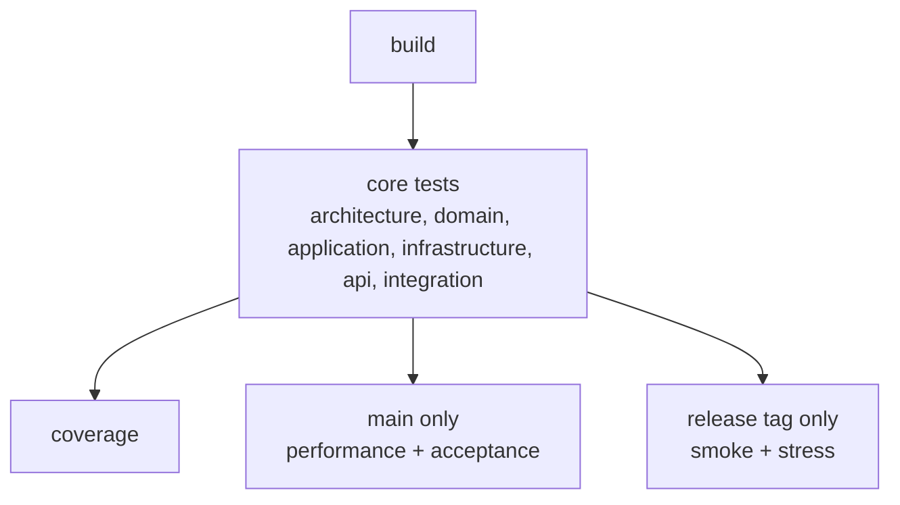

# CI/CD Pipeline Guide

## Overview

The pipeline is defined in [`.github/workflows/ci.yml`](../.github/workflows/ci.yml) and runs on GitHub Actions. It is designed around three concerns:

1. **Fast feedback on every commit** — build + core tests run on every branch and every PR.
2. **Quality gate before merging to main** — performance and acceptance tests are added when targeting `main`.
3. **Release validation** — smoke and stress tests only run when a release tag is pushed.

---

## Trigger Rules

### Case 1: Push to feature/hotfix branch

| Condition                            | Jobs that run                     |
| ------------------------------------ | --------------------------------- |
| `push` and `ref != main` and not tag | `build` + core tests + `coverage` |

### Case 2: Push to `main`

| Condition                | Jobs that run                                                              |
| ------------------------ | -------------------------------------------------------------------------- |
| `push` and `ref == main` | `build` + core tests + `coverage` + `test-performance` + `test-acceptance` |

### Case 3: Pull request targeting non-main branch

| Condition                             | Jobs that run                     |
| ------------------------------------- | --------------------------------- |
| `pull_request` and `base_ref != main` | `build` + core tests + `coverage` |

### Case 4: Pull request targeting `main`

| Condition                             | Jobs that run                                                              |
| ------------------------------------- | -------------------------------------------------------------------------- |
| `pull_request` and `base_ref == main` | `build` + core tests + `coverage` + `test-performance` + `test-acceptance` |

### Case 5: Release tag push

| Condition                    | Jobs that run                                                    |
| ---------------------------- | ---------------------------------------------------------------- |
| `push` tag matching `v*.*.*` | `build` + core tests + `coverage` + `test-smoke` + `test-stress` |

### Case 6: Non-release tag push

| Condition                        | Jobs that run                               |
| -------------------------------- | ------------------------------------------- |
| `push` tag not matching `v*.*.*` | none (workflow not triggered by tag filter) |

### Case 7: Draft PR to `main`

| Condition                                        | Jobs that run                           |
| ------------------------------------------------ | --------------------------------------- |
| `pull_request` with `base_ref == main` and draft | same as Case 4 (no draft-specific skip) |

### Case 8: Re-run failed jobs

| Condition                         | Jobs that run                                          |
| --------------------------------- | ------------------------------------------------------ |
| manual re-run from GitHub Actions | only selected failed jobs (or all jobs if full re-run) |

> The `concurrency` block cancels any in-progress run for the same ref when a new commit is pushed, preventing wasted runner minutes.

---

## Job Dependency Graph



All six core test jobs run **in parallel** after `build` succeeds. The later jobs (`coverage`, `test-performance`, etc.) wait for all six to pass via the `needs:` declaration.

---

## Jobs in Detail

### `build`

- Restores NuGet packages and compiles the entire solution in `Release` mode.
- Uses a **NuGet cache** keyed on the hash of all `.csproj` files and `Directory.Packages.props` to avoid redundant downloads.
- Uploads compiled binaries as a short-lived artifact (1 day) for downstream jobs.

---

### Core Test Jobs (all branches)

Each of the following jobs checks out the source, restores packages from cache, and runs `dotnet test` with:

- `--configuration Release` — always test the production build.
- `--settings .runsettings` — uses the project's coverage exclusion rules (migrations, DI, markers, etc.).
- `--collect:"XPlat Code Coverage"` — produces Cobertura XML used by the `coverage` job.
- A `.trx` logger for structured test result reporting.

| Job                   | Test Project                             | What it validates                                                    |
| --------------------- | ---------------------------------------- | -------------------------------------------------------------------- |
| `test-architecture`   | `CleanArchitecture.ArchitectureTests`    | Layer dependency rules (no infrastructure leaking into domain, etc.) |
| `test-domain`         | `CleanArchitecture.Domain.Tests`         | Domain entities, value objects, domain errors                        |
| `test-application`    | `CleanArchitecture.Application.Tests`    | Use cases, CQRS handlers, application services                       |
| `test-infrastructure` | `CleanArchitecture.Infrastructure.Tests` | Repository implementations, EF Core mappings                         |
| `test-api`            | `CleanArchitecture.Api.Tests`            | Controller/endpoint behaviour, request validation                    |
| `test-integration`    | `CleanArchitecture.IntegrationTests`     | Full stack with a real PostgreSQL container via **Testcontainers**   |

---

### `coverage`

- Waits for **all six** core test jobs.
- Downloads every coverage artifact into a single `TestResults/` directory.
- Runs **ReportGenerator** (installed as a global .NET tool) to merge all Cobertura XML files and produce:
  - An HTML report (`HtmlInline_AzurePipelines` format).
  - A merged `Cobertura.xml`.
  - SVG badge files.
- Test project assemblies are excluded from the report via `-assemblyfilters:"-*Tests*"`.
- Artifact is retained for **30 days**.

---

### `test-performance` _(main only)_

- Uses **BenchmarkDotNet**, which requires `OutputType=Exe` and `Release` configuration.
- Runs via `dotnet run` (not `dotnet test`) because BenchmarkDotNet controls its own process lifecycle.
- Passes `--job short` to use BenchmarkDotNet's `Job.Short` preset, which keeps wall-clock time reasonable in CI while still producing statistically valid measurements.
- Exports results as JSON into `BenchmarkDotNet.Artifacts/`.
- Artifact is retained for **30 days** to allow trend comparison across merges.

---

### `test-acceptance` _(main only)_

- Uses **SpecFlow** (BDD scenarios), **Playwright** (browser automation), and **Testcontainers** (PostgreSQL).
- Requires an explicit `dotnet build` step first so that `playwright.ps1` (the Playwright CLI bootstrapper) is present in the output directory before browsers are installed.
- Playwright browsers are installed with `--with-deps` to pull all OS-level dependencies on the Ubuntu runner.
- The actual test run uses `--no-build` because the binary is already compiled.

---

### `test-smoke` _(release tag only)_

- Lightweight sanity checks that the application starts and its critical paths respond correctly.
- Triggered only on tags matching `v*.*.*` (e.g., `v1.2.0`).
- Uses `Microsoft.AspNetCore.Mvc.Testing` and an in-memory EF Core database — no external services needed.

---

### `test-stress` _(release tag only)_

- Load and stress scenarios powered by **NBomber** + **NBomber.Http**.
- Runs with a 5-minute timeout (`--timeout 300000`) to prevent runaway scenarios from blocking the runner indefinitely.
- Uses Testcontainers for a real PostgreSQL instance to measure realistic throughput under load.
- Triggered only on tags matching `v*.*.*`, i.e., the same event that would trigger a production deployment.

---

## Artifacts Summary

| Artifact                      | Produced by           | Retention         |
| ----------------------------- | --------------------- | ----------------- |
| `build-artifacts`             | `build`               | 1 day             |
| `architecture-test-results`   | `test-architecture`   | default (90 days) |
| `domain-test-results`         | `test-domain`         | default           |
| `application-test-results`    | `test-application`    | default           |
| `infrastructure-test-results` | `test-infrastructure` | default           |
| `api-test-results`            | `test-api`            | default           |
| `integration-test-results`    | `test-integration`    | default           |
| `coverage-report`             | `coverage`            | 30 days           |
| `performance-results`         | `test-performance`    | 30 days           |
| `acceptance-test-results`     | `test-acceptance`     | 30 days           |
| `smoke-test-results`          | `test-smoke`          | 30 days           |
| `stress-test-results`         | `test-stress`         | 30 days           |

---

## NuGet Caching Strategy

Every job uses the same cache key:

```
nuget-{runner.os}-{hash of all *.csproj + Directory.Packages.props}
```

When any package version changes the hash changes and the cache is invalidated automatically. The `restore-keys` fallback (`nuget-{runner.os}-`) allows partial cache hits when only some projects changed, still saving bandwidth.

---

## Environment Variables

| Variable                            | Value                         | Purpose                               |
| ----------------------------------- | ----------------------------- | ------------------------------------- |
| `DOTNET_VERSION`                    | `10.0.x`                      | .NET SDK version used across all jobs |
| `DOTNET_SKIP_FIRST_TIME_EXPERIENCE` | `true`                        | Suppresses SDK first-run output       |
| `DOTNET_CLI_TELEMETRY_OPTOUT`       | `true`                        | Disables Microsoft CLI telemetry      |
| `NUGET_PACKAGES`                    | `{workspace}/.nuget/packages` | Directs NuGet to the cacheable path   |

---

## Adding a New Test Project

1. Add the `.csproj` to the solution under `/tests/`.
2. Create a new job in `ci.yml` following the same pattern as `test-domain` or `test-application`.
3. Add the new job to the `needs:` list of the `coverage` job (and the conditional jobs if appropriate).
4. Decide which tier it belongs to and set the correct `if:` condition (or omit it to run on all branches).
