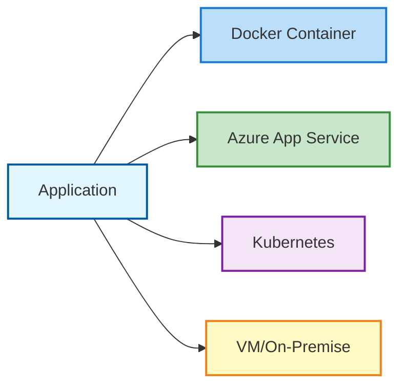
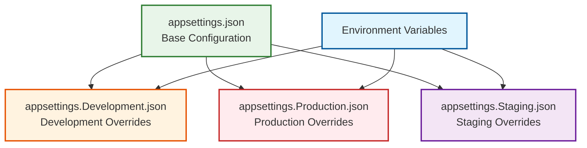
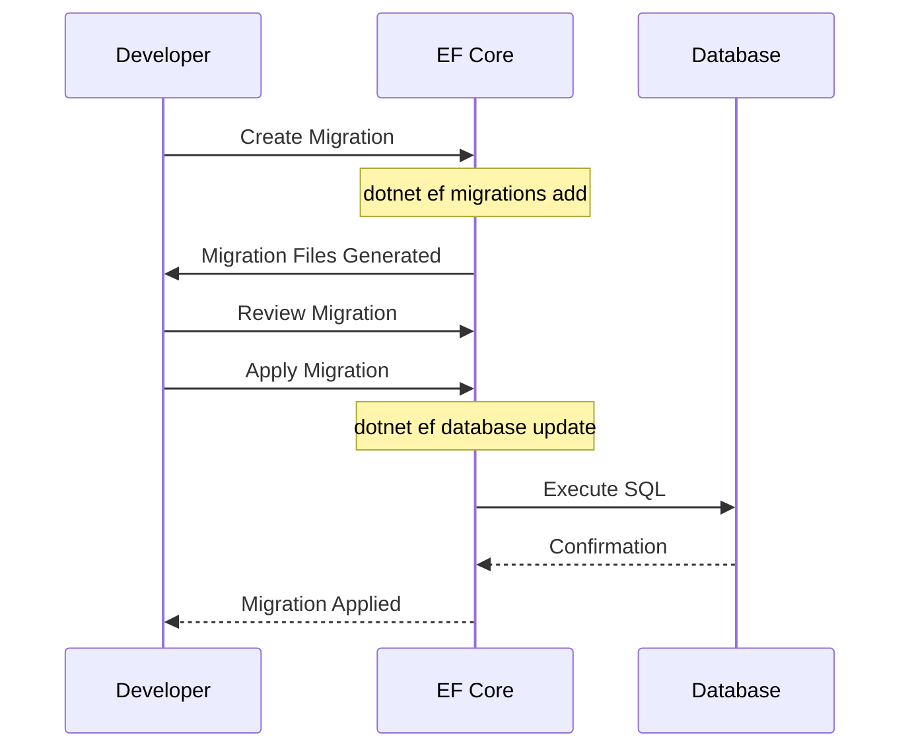
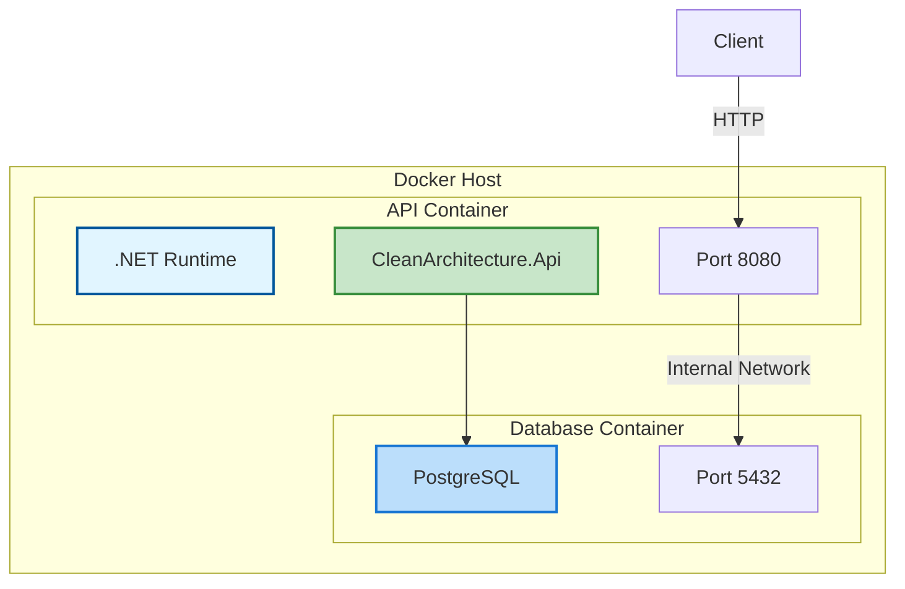
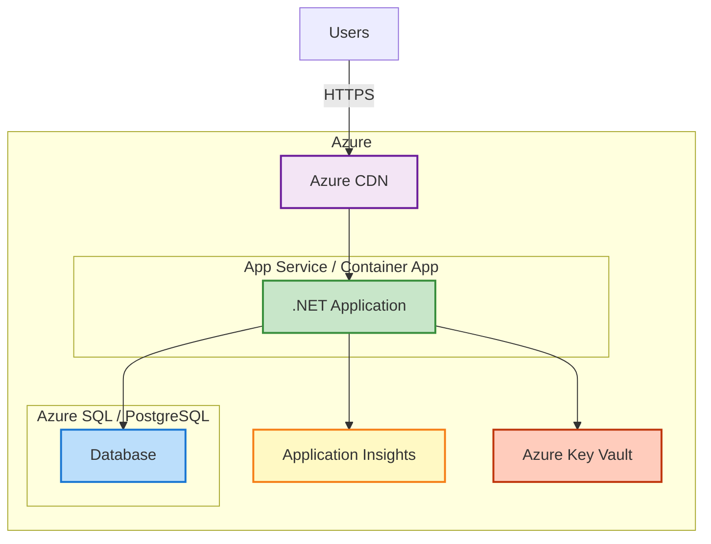
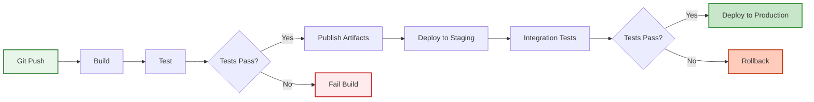
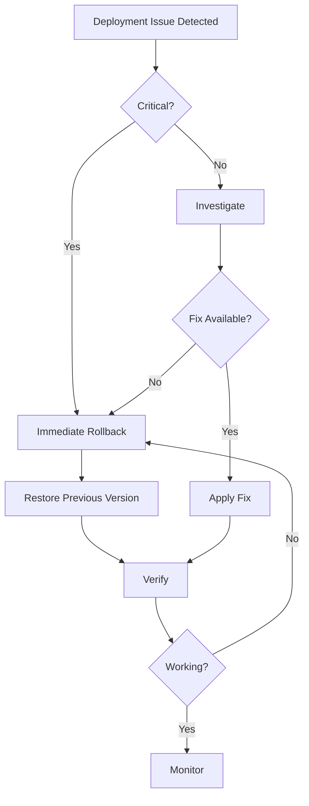

# Deployment Guide

Comprehensive guide for deploying the CleanArchitecture application to various environments.

## Table of Contents

1. [Deployment Options](#deployment-options)
2. [Prerequisites](#prerequisites)
3. [Environment Configuration](#environment-configuration)
4. [Database Setup](#database-setup)
5. [Docker Deployment](#docker-deployment)
6. [Azure Deployment](#azure-deployment)
7. [CI/CD Pipeline](#cicd-pipeline)
8. [Monitoring & Logging](#monitoring--logging)

## Deployment Options



## Prerequisites

### Development Environment

- .NET 10.0 SDK
- Docker Desktop (for containerization)
- Git
- Code editor (VS Code, Visual Studio, Rider)

### Production Environment

- .NET 10.0 Runtime
- Database server (PostgreSQL recommended, SQLite for development)
- Web server or container orchestrator
- SSL/TLS certificates

## Environment Configuration

### appsettings.json Structure

```json
{
  "Logging": {
    "LogLevel": {
      "Default": "Information",
      "Microsoft.AspNetCore": "Warning"
    }
  },
  "AllowedHosts": "*",
  "ConnectionStrings": {
    "DefaultConnection": "Data Source=CleanArchitecture.db"
  }
}
```

### Environment-Specific Settings



### Creating Environment Files

**appsettings.Production.json:**

```json
{
  "Logging": {
    "LogLevel": {
      "Default": "Warning",
      "Microsoft.AspNetCore": "Error"
    }
  },
  "ConnectionStrings": {
    "DefaultConnection": "Host=db.example.com;Database=cleanarch;Username=appuser;Password=***"
  }
}
```

### Environment Variables

```bash
# Set connection string
export ConnectionStrings__DefaultConnection="Host=localhost;Database=cleanarch;..."

# Set logging level
export Logging__LogLevel__Default="Information"

# Set ASPNETCORE environment
export ASPNETCORE_ENVIRONMENT="Production"
```

## Database Setup

### SQLite (Development)

Automatic - database created on first run.

```bash
dotnet run --project src/CleanArchitecture.Api
```

### PostgreSQL (Production)

#### 1. Install PostgreSQL

```bash
# Ubuntu/Debian
sudo apt-get install postgresql postgresql-contrib

# Docker
docker run -d \
  --name postgres \
  -e POSTGRES_PASSWORD=yourpassword \
  -e POSTGRES_DB=CleanArchitecture \
  -p 5432:5432 \
  postgres:16-alpine
```

#### 2. Create Database

```sql
CREATE DATABASE CleanArchitecture;
CREATE USER appuser WITH ENCRYPTED PASSWORD 'yourpassword';
GRANT ALL PRIVILEGES ON DATABASE CleanArchitecture TO appuser;
```

#### 3. Update Connection String

```json
{
  "ConnectionStrings": {
    "DefaultConnection": "Host=localhost;Database=CleanArchitecture;Username=appuser;Password=yourpassword"
  }
}
```

#### 4. Run Migrations

```bash
cd src/CleanArchitecture.Infrastructure
dotnet ef database update --startup-project ../CleanArchitecture.Api
```

### Database Migration Flow



## Docker Deployment

### Create Dockerfile

Create `Dockerfile` in root:

```dockerfile
# Build stage
FROM mcr.microsoft.com/dotnet/sdk:10.0 AS build
WORKDIR /src

# Copy solution and project files
COPY ["Directory.Build.props", "./"]
COPY ["Directory.Packages.props", "./"]
COPY ["src/CleanArchitecture.Api/CleanArchitecture.Api.csproj", "src/CleanArchitecture.Api/"]
COPY ["src/CleanArchitecture.Application/CleanArchitecture.Application.csproj", "src/CleanArchitecture.Application/"]
COPY ["src/CleanArchitecture.Domain/CleanArchitecture.Domain.csproj", "src/CleanArchitecture.Domain/"]
COPY ["src/CleanArchitecture.Infrastructure/CleanArchitecture.Infrastructure.csproj", "src/CleanArchitecture.Infrastructure/"]

# Restore packages
RUN dotnet restore "src/CleanArchitecture.Api/CleanArchitecture.Api.csproj"

# Copy source code
COPY . .

# Build application
WORKDIR "/src/src/CleanArchitecture.Api"
RUN dotnet build "CleanArchitecture.Api.csproj" -c Release -o /app/build

# Publish stage
FROM build AS publish
RUN dotnet publish "CleanArchitecture.Api.csproj" -c Release -o /app/publish /p:UseAppHost=false

# Runtime stage
FROM mcr.microsoft.com/dotnet/aspnet:10.0 AS final
WORKDIR /app
EXPOSE 8080
EXPOSE 8081

COPY --from=publish /app/publish .
ENTRYPOINT ["dotnet", "CleanArchitecture.Api.dll"]
```

### Create docker-compose.yml

```yaml
version: "3.8"

services:
  api:
    build:
      context: .
      dockerfile: Dockerfile
    ports:
      - "5000:8080"
    environment:
      - ASPNETCORE_ENVIRONMENT=Production
      - ConnectionStrings__DefaultConnection=Host=db;Database=CleanArchitecture;Username=postgres;Password=yourpassword
    depends_on:
      - db
    networks:
      - cleanarch-network

  db:
    image: postgres:16-alpine
    environment:
      - POSTGRES_DB=CleanArchitecture
      - POSTGRES_PASSWORD=yourpassword
    ports:
      - "5432:5432"
    volumes:
      - postgres-data:/var/lib/postgresql/data
    networks:
      - cleanarch-network

volumes:
  postgres-data:

networks:
  cleanarch-network:
    driver: bridge
```

### Build and Run

```bash
# Build image
docker build -t CleanArchitecture-api .

# Run with docker-compose
docker-compose up -d

# View logs
docker-compose logs -f

# Stop services
docker-compose down
```

### Docker Container Architecture



## Azure Deployment

### Option 1: Azure App Service

#### Using Azure CLI

```bash
# Login to Azure
az login

# Create resource group
az group create --name cleanarch-rg --location eastus

# Create App Service plan
az appservice plan create \
  --name cleanarch-plan \
  --resource-group cleanarch-rg \
  --sku B1 \
  --is-linux

# Create web app
az webapp create \
  --name CleanArchitecture-api \
  --resource-group cleanarch-rg \
  --plan cleanarch-plan \
  --runtime "DOTNETCORE:10.0"

# Configure connection string
az webapp config connection-string set \
  --name CleanArchitecture-api \
  --resource-group cleanarch-rg \
  --connection-string-type SQLAzure \
  --settings DefaultConnection="your-connection-string"

# Deploy code
az webapp up \
  --name CleanArchitecture-api \
  --resource-group cleanarch-rg
```

#### Using Visual Studio

1. Right-click on `CleanArchitecture.Api` project
2. Select **Publish**
3. Choose **Azure**
4. Select **Azure App Service (Linux)**
5. Configure settings and publish

### Option 2: Azure Container Apps

```bash
# Create container registry
az acr create \
  --name cleanarchregistry \
  --resource-group cleanarch-rg \
  --sku Basic

# Build and push image
az acr build \
  --registry cleanarchregistry \
  --image CleanArchitecture-api:latest \
  .

# Create container app environment
az containerapp env create \
  --name cleanarch-env \
  --resource-group cleanarch-rg \
  --location eastus

# Create container app
az containerapp create \
  --name CleanArchitecture-api \
  --resource-group cleanarch-rg \
  --environment cleanarch-env \
  --image cleanarchregistry.azurecr.io/CleanArchitecture-api:latest \
  --target-port 8080 \
  --ingress external
```

### Azure Architecture



## CI/CD Pipeline

### GitHub Actions

Create `.github/workflows/deploy.yml`:

```yaml
name: Build and Deploy

on:
  push:
    branches: [main]
  pull_request:
    branches: [main]

jobs:
  build:
    runs-on: ubuntu-latest

    steps:
      - uses: actions/checkout@v3

      - name: Setup .NET
        uses: actions/setup-dotnet@v3
        with:
          dotnet-version: "10.0.x"

      - name: Restore dependencies
        run: dotnet restore

      - name: Build
        run: dotnet build --no-restore --configuration Release

      - name: Test
        run: dotnet test --no-build --verbosity normal --configuration Release

      - name: Publish
        run: dotnet publish src/CleanArchitecture.Api/CleanArchitecture.Api.csproj -c Release -o ./publish

      - name: Upload artifact
        uses: actions/upload-artifact@v3
        with:
          name: webapp
          path: ./publish

  deploy:
    needs: build
    runs-on: ubuntu-latest
    if: github.ref == 'refs/heads/main'

    steps:
      - name: Download artifact
        uses: actions/download-artifact@v3
        with:
          name: webapp
          path: ./publish

      - name: Deploy to Azure Web App
        uses: azure/webapps-deploy@v2
        with:
          app-name: CleanArchitecture-api
          publish-profile: ${{ secrets.AZURE_WEBAPP_PUBLISH_PROFILE }}
          package: ./publish
```

### CI/CD Flow



## Monitoring & Logging

### Application Insights

```bash
# Install package
dotnet add package Microsoft.ApplicationInsights.AspNetCore

# Configure in Program.cs
builder.Services.AddApplicationInsightsTelemetry();
```

### Health Checks

```csharp
// In Program.cs
builder.Services.AddHealthChecks()
    .AddDbContextCheck<ApplicationDbContext>();

app.MapHealthChecks("/health");
```

### Logging Configuration

```json
{
  "Logging": {
    "LogLevel": {
      "Default": "Information",
      "Microsoft.AspNetCore": "Warning",
      "Microsoft.EntityFrameworkCore": "Warning"
    },
    "ApplicationInsights": {
      "LogLevel": {
        "Default": "Information"
      }
    }
  }
}
```

## Security Checklist

- ✅ Use HTTPS in production
- ✅ Store secrets in Azure Key Vault or environment variables
- ✅ Enable CORS policies
- ✅ Implement authentication/authorization
- ✅ Use connection string encryption
- ✅ Enable request logging
- ✅ Implement rate limiting
- ✅ Regular security updates
- ✅ Database backups
- ✅ Disaster recovery plan

## Performance Optimization

1. **Enable Response Caching**
2. **Use Output Caching for GET endpoints**
3. **Database Connection Pooling**
4. **Add Redis for distributed caching**
5. **Enable compression**
6. **Use CDN for static assets**
7. **Optimize database queries**
8. **Monitor with Application Insights**

## Troubleshooting

### Common Issues

| Issue              | Solution                                      |
| ------------------ | --------------------------------------------- |
| Connection timeout | Check firewall rules, connection string       |
| Migration errors   | Verify database permissions                   |
| 502 Bad Gateway    | Check application logs, ensure app is running |
| High memory usage  | Review EF Core queries, implement pagination  |

### Useful Commands

```bash
# View app logs
az webapp log tail --name CleanArchitecture-api --resource-group cleanarch-rg

# Restart app
az webapp restart --name CleanArchitecture-api --resource-group cleanarch-rg

# View container logs
docker logs -f container-name

# Check health
curl https://your-app.azurewebsites.net/health
```

## Rollback Strategy



## Further Reading

- [ARCHITECTURE.md](./ARCHITECTURE.md) - System architecture
- [API_GUIDE.md](./API_GUIDE.md) - API documentation
- [TESTING_STRATEGY.md](./TESTING_STRATEGY.md) - Testing approach
- [Azure App Service Documentation](https://docs.microsoft.com/azure/app-service/)
- [Docker Documentation](https://docs.docker.com/)
