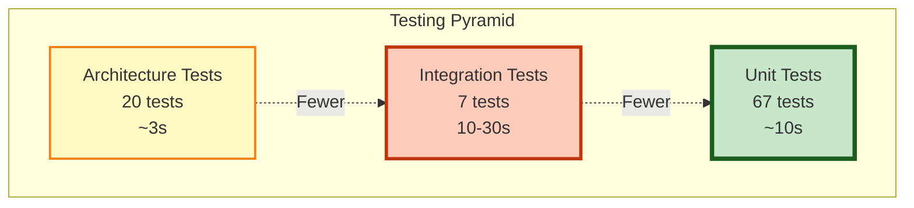

# Testing Strategy

This document describes the comprehensive testing strategy for the CleanArchitecture project, covering all layers with unit tests, integration tests, and architecture tests.

## Table of Contents

1. [Overview](#overview)
2. [Testing Pyramid](#testing-pyramid)
3. [Test Projects](#test-projects)
4. [Testing Tools](#testing-tools)
5. [Running Tests](#running-tests)
6. [Test Coverage](#test-coverage)
7. [Best Practices](#best-practices)

## Overview

The testing strategy follows the Testing Pyramid principle:

- **Unit Tests** - Fast, isolated tests for individual components
- **Integration Tests** - Tests with real databases and external dependencies
- **Architecture Tests** - Enforce architectural rules and boundaries

## Testing Pyramid



### Test Distribution

| Test Type          | Count  | Execution Time | Purpose                                    |
| ------------------ | ------ | -------------- | ------------------------------------------ |
| Unit Tests         | 67     | < 10s          | Verify business logic in isolation         |
| Integration Tests  | 7      | 10-30s         | Verify end-to-end flows with real database |
| Architecture Tests | 20     | < 5s           | Enforce architectural boundaries           |
| **Total**          | **94** | **< 45s**      | **Comprehensive coverage**                 |

## Test Projects

### 1. CleanArchitecture.Domain.Tests

**Purpose:** Test domain entities and value objects in isolation

**Test Coverage:**

- Entity creation and validation
- Business rule enforcement
- Domain error handling
- Entity equality and identity
- Value object immutability

**Key Tests:**

- `ItemTests.cs` - 19 tests for Item entity
- `EntityTests.cs` - 10 tests for Entity base class

**Technologies:**

- xUnit
- FluentAssertions
- Bogus (for fake data generation)

**Example:**

```csharp
[Fact]
public void Create_WithValidData_ShouldReturnSuccessResult()
{
    // Arrange
    var name = _faker.Commerce.ProductName();
    var description = _faker.Lorem.Sentence();

    // Act
    var result = Item.Create(name, description);

    // Assert
    result.IsError.Should().BeFalse();
    result.Value.Name.Should().Be(name);
}
```

### 2. CleanArchitecture.Application.Tests

**Purpose:** Test application services with mocked dependencies

**Test Coverage:**

- Service method behavior
- Error handling and validation
- Data transformation (Entity ↔ DTO)
- Repository interaction verification
- CancellationToken propagation

**Key Tests:**

- `ItemServiceTests.cs` - 18 tests for ItemService

**Technologies:**

- xUnit
- FluentAssertions
- NSubstitute (for mocking)
- Bogus (for fake data)

**Example:**

```csharp
[Fact]
public async Task GetItemByIdAsync_WhenItemExists_ShouldReturnItemResponse()
{
    // Arrange
    var item = Item.Create("Test Item", "Description").Value;
    _mockRepository.GetByIdAsync(item.Id).Returns(item);

    // Act
    var result = await _sut.GetItemByIdAsync(item.Id);

    // Assert
    result.IsError.Should().BeFalse();
    result.Value.Name.Should().Be("Test Item");
}
```

### 3. CleanArchitecture.Infrastructure.Tests

**Purpose:** Test repository implementations with in-memory database

**Test Coverage:**

- CRUD operations
- Query behavior
- Database constraints
- Transaction handling
- Change tracking

**Key Tests:**

- `ItemRepositoryTests.cs` - 20 tests for ItemRepository

**Technologies:**

- xUnit
- FluentAssertions
- Bogus
- Microsoft.EntityFrameworkCore.InMemory

**Example:**

```csharp
[Fact]
public async Task AddAsync_ShouldAddItemToDatabase()
{
    // Arrange
    var item = Item.Create("New Item", "Description").Value;

    // Act
    await _sut.AddAsync(item);

    // Assert
    var savedItem = await _context.Items.FindAsync(item.Id);
    savedItem.Should().NotBeNull();
}
```

### 4. CleanArchitecture.Api.Tests

**Purpose:** Test API endpoints with WebApplicationFactory

**Test Coverage:**

- HTTP status codes
- Request/Response serialization
- Endpoint routing
- Error responses (ProblemDetails)
- CRUD workflows

**Key Tests:**

- `ItemEndpointsTests.cs` - Tests for all Item endpoints

**Technologies:**

- xUnit
- FluentAssertions
- Bogus
- Microsoft.AspNetCore.Mvc.Testing

**Example:**

```csharp
[Fact]
public async Task CreateItem_WithValidRequest_ShouldReturnCreated()
{
    // Arrange
    var request = new CreateItemRequest("Product", "Description");

    // Act
    var response = await _client.PostAsJsonAsync("/api/items", request);

    // Assert
    response.StatusCode.Should().Be(HttpStatusCode.Created);
}
```

### 5. CleanArchitecture.IntegrationTests

**Purpose:** Test complete workflows with real PostgreSQL database using Testcontainers

**Test Coverage:**

- End-to-end CRUD workflows
- Data persistence verification
- Concurrent operations
- Database constraints validation
- Transaction behavior

**Key Tests:**

- `ItemIntegrationTests.cs` - 7 comprehensive integration tests

**Technologies:**

- xUnit
- FluentAssertions
- Bogus
- Testcontainers.PostgreSql
- Microsoft.AspNetCore.Mvc.Testing

**Requirements:**

- Docker Desktop must be running
- Pulls `postgres:16-alpine` image on first run

**Example:**

```csharp
[Fact]
public async Task FullWorkflow_CreateReadUpdateDelete_ShouldWorkWithRealDatabase()
{
    // Create, Read, Update, Delete operations
    // Verified against real PostgreSQL database in container
}
```

**Running Integration Tests:**

```bash
# Ensure Docker is running
docker ps

# Run integration tests
dotnet test CleanArchitecture.IntegrationTests
```

### 6. CleanArchitecture.ArchitectureTests

**Purpose:** Enforce Clean Architecture principles and layer boundaries

**Test Coverage:**

- Layer dependency rules
- Naming conventions
- Class accessibility rules
- Immutability patterns
- Architectural patterns

**Key Tests:**

- `ArchitectureTests.cs` - 20 tests enforcing architectural rules

**Technologies:**

- xUnit
- FluentAssertions
- NetArchTest.Rules

**Enforced Rules:**

#### Layer Dependencies

```
┌─────────────────────┐
│        API          │  ← Can depend on all layers
├─────────────────────┤
│   Infrastructure    │  ← Can depend on Application, Domain
├─────────────────────┤
│    Application      │  ← Can depend on Domain only
├─────────────────────┤
│       Domain        │  ← No dependencies on other layers
└─────────────────────┘
```

#### Naming Conventions

- Interfaces start with `I`
- Services end with `Service`
- Repositories end with `Repository`
- Endpoints end with `Endpoints`
- Request/Response models follow naming pattern

#### Class Rules

- Domain entities are sealed
- Services are sealed
- EF Core configurations are internal and sealed
- Endpoint classes are static

**Example:**

```csharp
[Fact]
public void Domain_ShouldNotHaveDependencyOnOtherLayers()
{
    var result = Types.InAssembly(DomainAssembly)
        .ShouldNot()
        .HaveDependencyOnAny(otherLayers)
        .GetResult();

    result.IsSuccessful.Should().BeTrue();
}
```

## Testing Tools

### Core Testing Framework

- **xUnit** - Test framework with excellent .NET integration
- **FluentAssertions** - Readable assertion syntax
- **Bogus** - Realistic fake data generation

### Mocking & Isolation

- **NSubstitute** - Clean mocking syntax
- **Microsoft.EntityFrameworkCore.InMemory** - In-memory database for unit tests

### Integration Testing

- **Testcontainers** - Real database containers for integration tests
- **WebApplicationFactory** - ASP.NET Core test host

### Architecture Testing

- **NetArchTest.Rules** - Enforce architectural rules

## Running Tests

### Run All Tests

```bash
# From root directory
dotnet test

# With detailed output
dotnet test --verbosity detailed

# With code coverage
dotnet test --collect:"XPlat Code Coverage"
```

### Run Specific Test Project

```bash
# Unit tests only
dotnet test tests/CleanArchitecture.Domain.Tests
dotnet test tests/CleanArchitecture.Application.Tests
dotnet test tests/CleanArchitecture.Infrastructure.Tests

# Integration tests (requires Docker)
dotnet test tests/CleanArchitecture.IntegrationTests

# Architecture tests
dotnet test tests/CleanArchitecture.ArchitectureTests
```

### Run Specific Test Class

```bash
dotnet test --filter "FullyQualifiedName~ItemTests"
```

### Run Specific Test Method

```bash
dotnet test --filter "Name=Create_WithValidData_ShouldReturnSuccessResult"
```

### Run Tests in Watch Mode

```bash
dotnet watch test
```

## Test Coverage

### Coverage by Layer

| Layer          | Line Coverage | Branch Coverage | Notes                           |
| -------------- | ------------- | --------------- | ------------------------------- |
| Domain         | 95%+          | 90%+            | High coverage of business rules |
| Application    | 90%+          | 85%+            | Service methods fully tested    |
| Infrastructure | 85%+          | 80%+            | Repository operations covered   |
| API            | 80%+          | 75%+            | Endpoint integration tested     |

### Generating Coverage Reports

```bash
# Install ReportGenerator
dotnet tool install -g dotnet-reportgenerator-globaltool

# Run tests with coverage
dotnet test --collect:"XPlat Code Coverage"

# Generate HTML report
reportgenerator -reports:"**/coverage.cobertura.xml" -targetdir:"coverage" -reporttypes:Html

# Open report
start coverage/index.html  # Windows
open coverage/index.html   # macOS
```

## Best Practices

### Test Organization

✅ **DO:**

- Follow Arrange-Act-Assert (AAA) pattern
- One assertion concept per test
- Clear test names describing behavior
- Use meaningful fake data from Bogus
- Test both happy path and error cases

❌ **DON'T:**

- Test implementation details
- Create interdependent tests
- Use real databases in unit tests
- Skip cleanup in integration tests
- Test private methods directly

### Test Naming Convention

```csharp
[MethodName]_[Scenario]_[ExpectedBehavior]

// Examples:
Create_WithValidData_ShouldReturnSuccessResult()
GetItemById_WhenItemDoesNotExist_ShouldReturnNotFoundError()
```

### Mocking Best Practices

```csharp
// Clear and focused setup
_mockRepository
    .GetByIdAsync(itemId, Arg.Any<CancellationToken>())
    .Returns(item);

// Verify interactions
await _mockRepository.Received(1)
    .AddAsync(Arg.Any<Item>(), Arg.Any<CancellationToken>());
```

### Fake Data Generation

```csharp
// Use Bogus for realistic test data
var faker = new Faker();
var name = faker.Commerce.ProductName();
var description = faker.Lorem.Sentence();

// Avoid magic strings and hardcoded values
```

### Integration Test Isolation

```csharp
// Each test gets a fresh database
private readonly IntegrationTestWebAppFactory _factory;

public ItemIntegrationTests(IntegrationTestWebAppFactory factory)
{
    _factory = factory;
    _client = factory.CreateClient();
}
```

### Architecture Test Documentation

```csharp
// Document the "why" in architecture tests
[Fact]
public void Domain_ShouldNotHaveDependencyOnOtherLayers()
{
    // This ensures the domain remains pure and portable
    // Domain should not know about infrastructure or UI
}
```

## Continuous Integration

### GitHub Actions Example

```yaml
name: Tests

on: [push, pull_request]

jobs:
  test:
    runs-on: ubuntu-latest

    services:
      postgres:
        image: postgres:16-alpine
        env:
          POSTGRES_PASSWORD: postgres
        options: >-
          --health-cmd pg_isready
          --health-interval 10s
          --health-timeout 5s
          --health-retries 5

    steps:
      - uses: actions/checkout@v3

      - name: Setup .NET
        uses: actions/setup-dotnet@v3
        with:
          dotnet-version: "10.0.x"

      - name: Restore dependencies
        run: dotnet restore

      - name: Build
        run: dotnet build --no-restore

      - name: Run all tests
        run: dotnet test --no-build --verbosity normal --collect:"XPlat Code Coverage"

      - name: Upload coverage
        uses: codecov/codecov-action@v3
```

## Troubleshooting

### Common Issues

**Issue:** Integration tests fail with "Docker not found"

```bash
# Solution: Start Docker Desktop
docker ps  # Verify Docker is running
```

**Issue:** Flaky tests due to timing

```bash
# Solution: Use proper async/await patterns
# Avoid Thread.Sleep in tests
# Use Task.Delay with cancellation tokens
```

**Issue:** Tests run slowly

```bash
# Solution: Run tests in parallel (xUnit default)
# Use in-memory database for unit tests
# Reserve Testcontainers for integration tests only
```

## Summary

This comprehensive testing strategy ensures:

- ✅ High code quality and confidence
- ✅ Fast feedback during development
- ✅ Architectural integrity maintained
- ✅ Regression prevention
- ✅ Safe refactoring capabilities
- ✅ Clear documentation through tests

**Total Test Coverage:** 94 tests across all layers ensuring robust application behavior.
